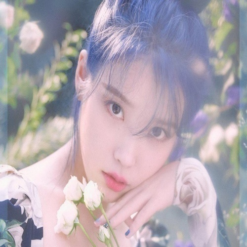

# Assignments Week2 & Week3
## • Read the article about Color conversion algorithms
#### [OpenCV: Color Conversions](https://docs.opencv.org/3.4/de/d25/imgproc_color_conversions.html)
## • Convert RGB to Gray
   ### Algorithm
- RGB[A] to Gry: ```Y ← 0.299 × R + 0.587 × G + 0.114 × B```
### Using Python
- Convert Img2Bianry
- RGB to Gray
- Convert Binary2Img

### Using HDL code
- Floating-point Mul
- Floating-point Add
- Connect

## • Simulate and compare between two method
RGB Image 



## Results
- Largest error is 0.0254974365234375
- Verilog 


- Python


- 


